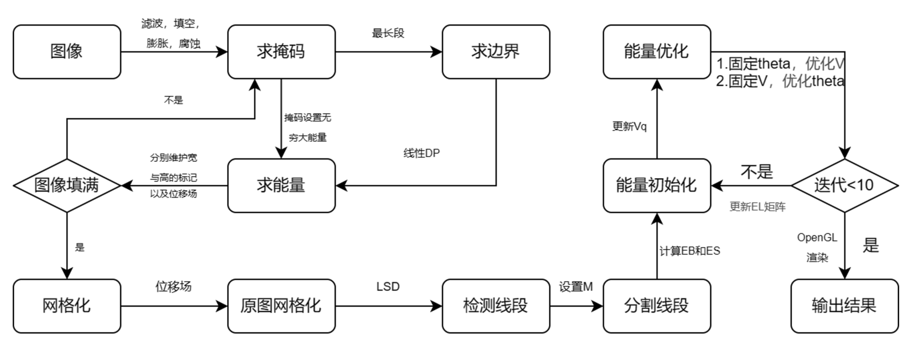
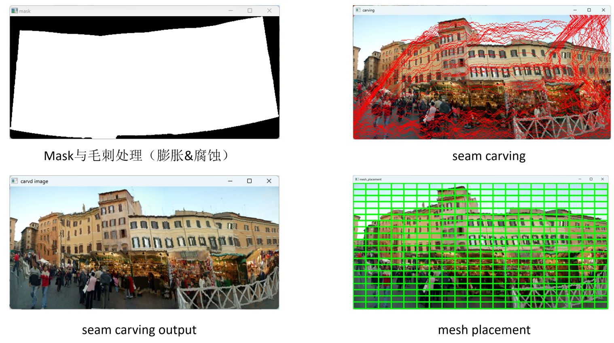
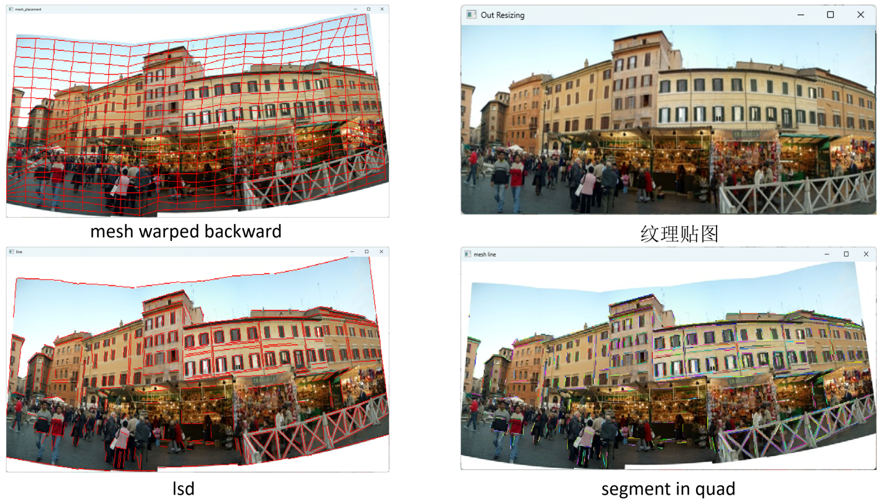
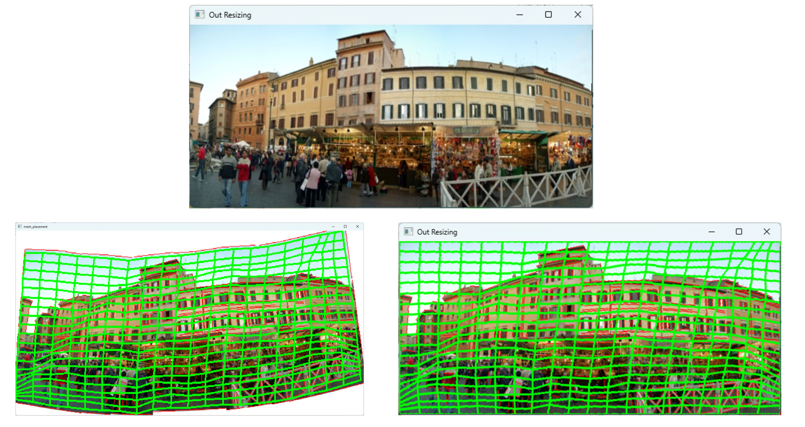

# Result

# 算法流程

# 实验过程

# 数学推导

### 多元二次函数表示的极值

**函数表达式**

$$
f(x) = x^TAx+Bx+C
$$
**求解极小值 **

求导得$f'(x)=2Ax+B=0$,即:
$$
Ax=-\frac{1}{2}B
$$
**期望表达式**

当 $\theta$ 固定时:

$$
E(V) = E_S(V)+\lambda_LE_L(V) +\lambda_BE_B(V)
$$
其中$E_S,E_L,E_B$表示形状、线、边界能量函数，$\lambda_L,\lambda_B$表示各自的权重。
$$
E(V)=[E_S,E_L,E_B]*\begin{bmatrix}1\\\lambda_L\\\lambda_B\end{bmatrix}
$$
$E_S(V)$由下式表示：

$$
E_S(V)=\frac{1}{N_S}\sum ||A_qV_q||^2
$$
其中$A_q$定义为：
$$
A_q=A_q(A_q^TA_q)^{-1}A^{T}_{q}-I
$$

$E_L(V)$由下式表示:
$$
E_L(V) = \frac{1}{N_L}\sum||C_j*e_{j}||^2
$$
其中$C_j$ 是线段j旋转的矩阵，定义为
$$
C_j = R\hat{e_j}(\hat{e_j}^T\hat{e_j})^{-1}\hat{e_j}^TR^T-I
$$
其中$e_{j}$为$j$在所属的桶内的输出的双线性插值之后的向量,$\hat{e}$为初始向量。

$e_j$可以由$Vq$进行双线性插值得到$e_j=\hat{e}'_jF_L$ 

$$\begin{bmatrix}
{\hat{x}_0}&{\hat{y}_0}&\hat{x}_0\hat{y}_0&1&0&0&0&0\\0&0&0&0&{\hat{x}_1}&{\hat{y}_1}&\hat{x}_1\hat{y}_1&1\\
{\vdots}&{\vdots}&{\vdots}&{\vdots}&{\vdots}&{\vdots}&{\vdots}&{\vdots} \\ 0&0&0&0&{\hat{x}_3}&{\hat{y}_3}&\hat{x}_3\hat{y}_3&1\\
\end{bmatrix}*F_L=\begin{bmatrix}x_0 \\ y_0\\\vdots \\x_3\\{y_3}\end{bmatrix}$$

令左边这个为$k_j$则$e_j=\hat{e}_j'k^{-1}*V_q$

更进一步令$K_j=\hat{e}_jk_j^{-1}$

注意$\hat{e}$​是向量还应操作$\begin{bmatrix} 1 & 0& -1 &0\\0&1&0&1 \end{bmatrix} *\begin{bmatrix} x_0 \\ y_0 \\ x_1 \\y_1\end{bmatrix}=[x_0-x_1,y_0-y_1]
$

总的来说  $\begin{bmatrix} [2,2] *& [2,4]* & [4,8]* & [8,8]* & [8,1] & = [2,1] \\ \vdots & \vdots & \vdots& \vdots& \vdots\\ C& D & e' & F & V_q & = e\end{bmatrix}$

求解$||X||^2$直接用最小二乘法就行

对于$E_B(V)$ 由于非线性，需要求解的时候特殊约束处理，视作矩阵B

综上可知

求解$AV_q=B$

简而言之，就是把每一个网络、每一个线段、每一个约束条件看作一个线性方程计算Energy

